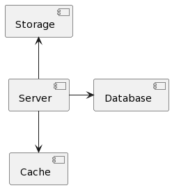

# Tasklist

This application helps you organize creating and accessing tasks.

You can access Swagger and see all available endpoints by
visiting `http://localhost:8080/swagger-ui/index.html`

## Technologies

* Java 17
* Maven
* Spring Boot 3
* JPA (jdbc, MyBatis)
* Security, JWT
* Swagger
* PostgreSQL
* Redis
* MinIO
* Liquibase
* Docker

## Sequence diagram

## Component diagram

Main application communicates with cache (uses Redis), database (uses
Postgresql), storage (uses MinIO).

## Class diagram

We have two main classes - **User** and **Task**.

**User** class represents user in this application. User can log in, create and
update tasks.

User can have roles - `ROLE_USER` or `ROLE_ADMIN`.

**Task** class represents task in this application. Task can be created by user.

Task can have images.

## Environments

To run this application you need to create `.env` file in root directory with
next environments:

- `HOST` - host of Postgresql database
- `POSTGRES_USERNAME` - username for Postgresql database
- `POSTGRES_PASSWORD` - password for Postgresql database
- `POSTGRES_DATABASE` - name of Postgresql database
- `POSTGRES_SCHEMA` - name of Postgresql schema
- `REDIS_HOST` - host of Redis instance
- `REDIS_PASSWORD` - password for Redis
- `JWT_SECRET` - secret string for JWT tokens
- `MINIO_BUCKET` - name of bucket for MinIO
- `MINIO_URL` - URL of MinIO instance
- `MINIO_ACCESS_KEY` - access key of MinIO
- `MINIO_SECRET_KEY` - secret key of MinIO
- `SPRING_MAIL_HOST` - host of mail server
- `SPRING_MAIL_PORT` - port of mail server
- `SPRING_MAIL_USERNAME` - username of mail server
- `SPRING_MAIL_PASSWORD` - password of mail server

You can use example `.env.example` file with some predefined environments.

